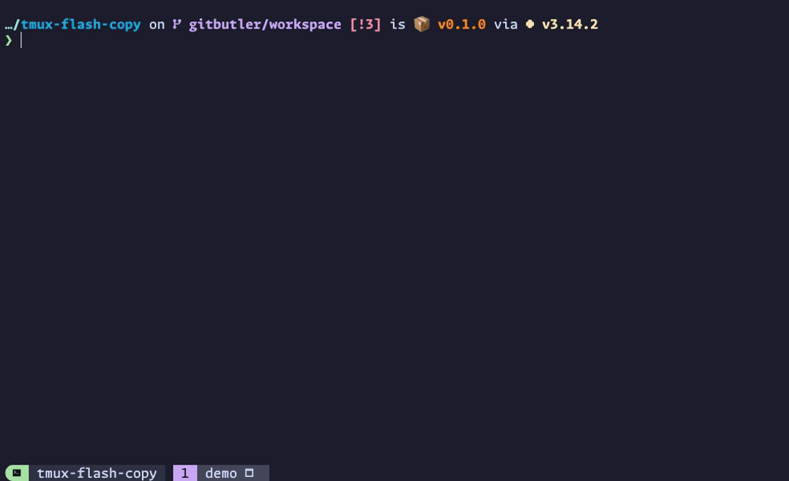

# ⚡📋 tmux-flash-copy

A tmux plugin inspired by [flash.nvim](https://github.com/folke/flash.nvim) that enables you to search visible words in the current tmux pane, then copy that word to the system clipboard by pressing the associated label key.



## Features

- **Dynamic Search**: Type to filter words in real-time as you search.
- **Overlay Labels**: Single key selection with labels overlayed on matches in the pane.
- **Dimmed Display**: Non-matching content is dimmed for visual focus.
- **Clipboard Copy**: Selected text is immediately copied to the system clipboard.
- **Auto-paste Modifier**: Use semicolon key as a modifier to automatically paste selected text.
- **Configurable Word Boundaries**: Honours tmux's `word-separators` by default, with override support.

### Table of Contents

- [Requirements](#requirements)
- [Installation](#installation)
- [Usage](#usage)
- [Customisation](#customisation)
- [ANSI colour codes](#ansi-colour-codes)
- [Clipboard Implementation](#clipboard-implementation)
- [Debugging](#debugging)
- [Development & Testing](#development--testing)
- [Future enhancements](#future-enhancements)
- [Demonstration](#demonstration)
- [Contributing](#contributing)
- [Inspiration](#inspiration)
- [Other plugins](#other-plugins)

## Requirements

- [tmux](https://github.com/tmux/tmux) 3.2+ (tested with tmux 3.6a)
- [Python](https://www.python.org) 3.9+ (tested with Python 3.14.2)

## Installation

### Using TPM (recommended)

1. Install [TPM (Tmux Plugin Manager)](https://github.com/tmux-plugins/tpm).

2. Add `tmux-flash-copy` to your `~/.tmux.conf`:

    ```bash
    set -g @plugin 'kristijan/tmux-flash-copy'
    ```

3. Start tmux and install the plugin.

    Press `<tmux_prefix> + I` (capital i, as in Install) to install the plugin.

    Press `<tmux_prefix> + U` (capital u, as in Update) to update the plugin.

### Manual installation

1. Clone this repository to your desired location:

    ```bash
    git clone https://github.com/kristijan/tmux-flash-copy.git ~/.tmux/plugins/tmux-flash-copy
    ```

2. Add the following to your `~/.tmux.conf`:

    ```bash
    run-shell ~/.tmux/plugins/tmux-flash-copy/tmux-flash-copy.tmux
    ```

    Any customisation variables should be set **BEFORE** the `run-shell` line so they're correctly sourced.

    For example:

    ```bash
    set -g @flash-copy-bind-key "f"
    set -g @flash-copy-prompt-indicator "❯"
    run-shell ~/.tmux/plugins/tmux-flash-copy/tmux-flash-copy.tmux
    ```

3. Reload your tmux configuration:

    ```bash
    tmux source-file ~/.tmux.conf
    ```

## Usage

1. Press the bind key (default: `<tmux_prefix> S-f` (that's `<tmux_prefix> Shift+f`)) to activate the search.
2. Type to search for words in the pane. The search is dynamic and updates as you type.
3. Matching words will be highlighted in yellow with single-character labels in green.
4. Press the label key corresponding to the word you want to copy.
5. The selected text is immediately copied to your clipboard, and you are returned to your pane.

> [!TIP]
> You can auto-paste your selected match by using the `;` (semicolon) modifier key.
> See the [Auto-paste text](#auto-paste-text) section for more details.

### Keybindings when search is active

| Keybinding       | Action                                                                    |
| ---------------- | ------------------------------------------------------------------------- |
| `Ctrl+U`         | Clear the entire search query                                             |
| `Ctrl+W`         | Clear the previous word                                                   |
| `Enter`          | Copy the first match (determined by `@flash-copy-reverse-search` setting) |
| `;`+`<label>`    | Copy and auto-paste the word (if auto-paste enabled)                      |
| `Ctrl+C` / `ESC` | Cancel and close the popup without copying                                |

### Auto-paste text

By default, selecting a label will copy the text to the clipboard only. If auto-paste is enabled (the default), you can also paste the text automatically:

1. Press `;` (semicolon) (or `Shift+;` (colon) for uppercase labels) to activate the auto-paste modifier
2. Then press the label key to paste a speific word, or `Enter` to paste the first match

The selected text will be copied to the clipboard AND automatically pasted into your pane.

## Customisation

### Configuration options

The following configuration options are supported. Default values are listed, with overrides to be added to your tmux configuration (`~/.tmux.conf`).

#### General options

| Option                                                                      | Description                                  |
| --------------------------------------------------------------------------- | -------------------------------------------- |
| [`@flash-copy-bind-key`](#flash-copy-bind-key-default-s-f)                  | Key binding to activate tmux-flash-copy      |
| [`@flash-copy-word-separators`](#flash-copy-word-separators)                | Characters that define word boundaries       |
| [`@flash-copy-case-sensitive`](#flash-copy-case-sensitive-default-off)      | Case-sensitive searching                     |
| [`@flash-copy-reverse-search`](#flash-copy-reverse-search-default-on)       | Direction of label assignment when searching |
| [`@flash-copy-auto-paste`](#flash-copy-auto-paste-default-on)                 | Enable auto-paste modifier functionality     |
| [`@flash-copy-debug`](#debugging)                                           | Enable debug logging                         |

#### Prompt

| Option                                                                                                      | Description                                                |
| ----------------------------------------------------------------------------------------------------------- | ---------------------------------------------------------- |
| [`@flash-copy-prompt-position`](#flash-copy-prompt-position-default-bottom)                                 | Controls where the prompt is positioned in the pane window |
| [`@flash-copy-prompt-indicator`](#flash-copy-prompt-indicator-default-)                                     | Customises the prompt indicator                            |
| [`@flash-copy-prompt-colour`](#flash-copy-prompt-colour-default-0331m---bold)                               | Customises the prompt indicator colour                     |
| [`@flash-copy-prompt-placeholder-text`](#flash-copy-prompt-placeholder-text-default-search)                 | Customises prompt placeholder text                         |

#### Matched text and labels

| Option                                                                                       | Description                                                                           |
| -------------------------------------------------------------------------------------------- | ------------------------------------------------------------------------------------- |
| [`@flash-copy-highlight-colour`](#flash-copy-highlight-colour-default-033133m---bold-yellow) | Customises the colour used to highlight the matched portion of text in search results |
| [`@flash-copy-label-colour`](#flash-copy-label-colour-default-033132m---bold-green)          | Customises the colour used for match labels                                           |

___

#### `@flash-copy-bind-key` (default: `S-f`)

Customise the key binding to activate tmux-flash-copy.

The default binding is `S-f` (Shift+F), which when combined with your tmux prefix becomes `<prefix> S-f`.

```bash
# Change the key binding to Ctrl+F
set -g @flash-copy-bind-key "C-f"

# Or use Alt+F
set -g @flash-copy-bind-key "M-f"
```

#### `@flash-copy-word-separators`

Customise the characters that define word boundaries.

Priority order.

  1. **First**: Check @flash-copy-word-separators (custom user override)
  2. **Fallback**: Read tmux's built-in word-separators window option (can be overriden in `~/.tmux.conf`)

This allows you to control what constitutes a "word" for the plugin. This is particularly useful when working with configuration strings like `#{@variable_name}` where you want `@` and `}` to be word boundaries.

```bash
# Use custom word separators (overrides tmux's word-separators)
set -g @flash-copy-word-separators ' ()":,;<>~!@#$%^&*|+=[]{}?`'

# To add single quote to the separators
set -ag @flash-copy-word-separators "'"
```

#### `@flash-copy-case-sensitive` (default: `off`)

Controls whether search is case-sensitive or case-insensitive.

- `on` or `true`: Search is case-sensitive (e.g., `Test` will not match `test`)
- `off` or `false`: Search is case-insensitive, ignoring case differences (default behaviour)

```bash
# Enable case-sensitive search
set -g @flash-copy-case-sensitive "on"
```

#### `@flash-copy-reverse-search` (default: `on`)

Controls the direction of label assignment when searching:

- `on` or `true`: Labels are assigned from bottom to top
- `off` or `false`: Labels are assigned from top to bottom

Setting to `off` is useful if you have your `@flash-copy-prompt-position` at the top of the screen. This means matches are assigned closer to your prompt.

```bash
# Switch to top-to-bottom search
set -g @flash-copy-reverse-search "off"
```

#### `@flash-copy-auto-paste` (default: `on`)

Controls whether the auto-paste modifier (semicolon and colon keys) is enabled.

- `on` or `true`: Auto-paste modifier is enabled (default). Pressing `;` (semicolon) or `:` (colon) activates the auto-paste mode, allowing you to copy and automatically paste selected text.
- `off` or `false`: Auto-paste modifier is disabled. The `;` (semicolon) and `:` (colon) keys work as regular characters in search queries instead of being reserved for the modifier.

```bash
# Disable auto-paste modifier (semicolon and colon work in searches)
set -g @flash-copy-auto-paste "off"
```

#### `@flash-copy-prompt-position` (default: `bottom`)

Controls where the prompt is positioned in the pane window.

- `bottom`: Prompt is displayed at the bottom (default)
- `top`: Prompt is displayed at the top

This is independent of the `@flash-copy-reverse-search` setting, allowing you to combine any desired configuration.

```bash
# Place prompt at the top of the popup
set -g @flash-copy-prompt-position "top"
```

#### `@flash-copy-prompt-indicator` (default: `>`)

Customises the prompt indicator or string displayed before the search input.

- Default: A single `>` character
- Can be set to any string (e.g., `>>>`, `❯`, `$`, `λ`)

```bash
# Use a different prompt character
set -g @flash-copy-prompt-indicator "❯"

# Use multiple characters as prompt
set -g @flash-copy-prompt-indicator ">>>"
```

#### `@flash-copy-prompt-colour` (default: `\033[1m` - bold)

Customises the ANSI colour code applied to the prompt indicator. This allows you to style the prompt with different colours and formatting (bold, dim, etc.).

- Default: `\033[1m` (bold)
- Accepts any valid ANSI colour code (see [ANSI colour codes](#ansi-colour-codes) section below)
- The colour applies only to the prompt indicator, not the search input

```bash
# Use bold red for the prompt
set -g @flash-copy-prompt-colour "\033[1;31m"

# Use bold cyan for the prompt
set -g @flash-copy-prompt-colour "\033[1;36m"

# Use non-bold yellow for the prompt
set -g @flash-copy-prompt-colour "\033[0;33m"
```

#### `@flash-copy-prompt-placeholder-text` (default: `search...`)

Customises the ghost text that appears in the prompt input when it's empty.

- If set to any string: Shows that string as dimmed placeholder text
- If set to empty string (`""`): Disables placeholder text entirely

The placeholder text automatically disappears when you start typing.

```bash
# Use custom placeholder
set -g @flash-copy-prompt-placeholder-text "Type to search..."

# Disable placeholder text
set -g @flash-copy-prompt-placeholder-text ""
```

#### `@flash-copy-highlight-colour` (default: `\033[1;33m` - bold yellow)

Customises the ANSI colour code used to highlight the matched portion of text in search results.

- Default: `\033[1;33m` (bold yellow)
- Accepts any valid ANSI colour code (see [ANSI colour codes](#ansi-colour-codes) section below)

```bash
# Use bold red for highlighting
set -g @flash-copy-highlight-colour "\033[1;31m"
```

#### `@flash-copy-label-colour` (default: `\033[1;32m` - bold green)

Customises the ANSI colour code used for match labels (the keyboard shortcut indicator).

- Default: `\033[1;32m` (bold green)
- Accepts any valid ANSI colour code (see [ANSI colour codes](#ansi-colour-codes) section below)

```bash
# Use bold cyan for labels
set -g @flash-copy-label-colour "\033[1;36m"
```

### Customising Label Characters

Labels are guaranteed not to exist as a continuation of the search pattern. Edit `src/search_interface.py` and modify the `DEFAULT_LABELS` string in the `SearchInterface` class.

```python
DEFAULT_LABELS = "asdfghjklqwertyuiopzxcvbnmASDFGHJKLQWERTYUIOPZXCVBNM"
```

The above order are the defaults from [flash.nvim](https://github.com/folke/flash.nvim), but you can arrange them in the order you prefer.

## ANSI colour codes

Common ANSI colour codes.

- `\033[1;31m` - Bold red
- `\033[1;32m` - Bold green
- `\033[1;33m` - Bold yellow
- `\033[1;34m` - Bold blue
- `\033[1;35m` - Bold magenta
- `\033[1;36m` - Bold cyan
- `\033[1;37m` - Bold white
- `\033[0;31m` - Red (non-bold)
- `\033[0;32m` - Green (non-bold)

## Clipboard Implementation

For information on clipboard methods, troubleshooting, and platform-specific recommendations, see [CLIPBOARD.md](CLIPBOARD.md).

## Debugging

For information on debugging information, including log format, troubleshooting specific issues, and example debug sessions, see [DEBUGGING.md](DEBUGGING.md).

## Development & Testing

For information on setting up a development environment, running tests, and code quality checks, see [TESTING.md](TESTING.md).

## Future enhancements

- [ ] I'm manually parsing the output of `tmux` commands using a subprocess. This should ideally be using something like [libtmux](https://github.com/tmux-python/libtmux). I might consider switching to this in a major revision update, as I'm likely leaving increased performance on the table.
- [ ] Initially I tried getting this to work using the terminal and tmux's alternate screen functionality, but could come to a solution that didn't involve using `send-keys` to enable alternate screen. Using an alternate screen could potentially simplify the popup placement logic.

## Demonstration

The following configuration is used in the demonstration GIF.

```bash
set -g @plugin 'kristijan/tmux-flash-copy'
set -g @flash-copy-prompt-indicator "❯"
set -g @flash-copy-prompt-colour "\033[38;2;203;166;247m"
```

## Contributing

Contributions are welcome! Please feel free to submit issues or pull requests.

Before submitting a PR:

1. Run tests and code quality checks (see [TESTING.md](TESTING.md)).
2. Ensure all tests pass.
3. Add tests for new functionality.
4. Update documentation as needed.

## Inspiration

This plugin is inspired by the excellent [flash.nvim](https://github.com/folke/flash.nvim) plugin for Neovim, adapted for the tmux ecosystem.

## Other plugins

Check my other plugin  [tmux-fzf-pane-switch](https://github.com/Kristijan/tmux-fzf-pane-switch), that allows you to switch to any pane, in any session, by searching and filtering using fzf.
